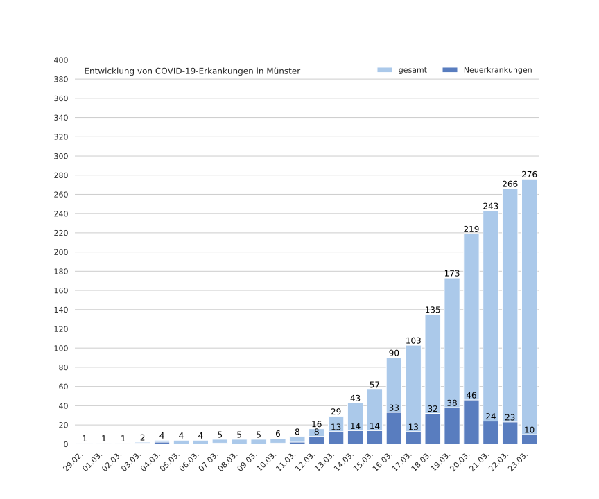

# COVID-19-NRW

Doku noch sehr rudimentär, sorry!
Daten bisher nur für Münster, tendentiell sollte es aber auch für andere Kommunen klappen.

Um eine neue Kommune hinzuzufügen, eine entsprechende Zeile unter `data/daily_reports` schreiben.
Dann `python plot_data.py` ausführen.

Für einen deutschen Plot muss dann noch folgendes in die erstellte HTML-Datei eingefügt werden (s. https://github.com/plotly/plotly.py/issues/2302):

```
# this needs to be copy-pasted to the created html file
# after the plotly script
<script src="https://cdn.plot.ly/plotly-locale-de-latest.js"></script>
```

Dies ist für die zweite Grafik:

```
<div>
  
</div>
```

Die HTML-Datei sollte damit alleine lauffähig sein.

Außerdem folgenden Code ganz nach unten für unser Logo & Co und damit wir sehen, wieviele Leute sich die Visualisierung angucken:

```
<br>
Ein Projekt von <a href="https://codeformuenster.org"></a><br>
<a href="https://codeformuenster.org/impressum/">Impressum und Datenschutzerklärung</a>
<!-- Fathom - simple website analytics - https://github.com/usefathom/fathom -->
<script>
(function(f, a, t, h, o, m){
  a[h]=a[h]||function(){
    (a[h].q=a[h].q||[]).push(arguments)
  };
  o=f.createElement('script'),
  m=f.getElementsByTagName('script')[0];
  o.async=1; o.src=t; o.id='fathom-script';
m.parentNode.insertBefore(o,m)
})(document, window, '//fathom.codeformuenster.org/tracker.js', 'fathom');
fathom('set', 'siteId', 'JJUAP');
fathom('trackPageview');
</script>
<!-- / Fathom -->
```


## Rechtliches

### Datenlizenz

<a rel="license"
  href="http://creativecommons.org/publicdomain/zero/1.0/">
  
</a>

Die Daten (Ordner `data`) sind unter CC0 lizenziert.
Soweit wie es möglich ist, verzichten wir auf jegliches Copyright/Urheberrecht und stellen diese Daten als gemeinfrei zur Verfügung. Sollte das nicht möglich sein, so erteilen wir hiermit eine bedinungslose Lizenz für die Daten.

### Softwarelizenz

Der Quelltext dieses Projekts ist lizenziert unter der Apache 2.0 Lizenz:

```
Copyright 2020 Code for Münster

Licensed under the Apache License, Version 2.0 (the "License");
you may not use these files except in compliance with the License.
You may obtain a copy of the License at

    http://www.apache.org/licenses/LICENSE-2.0

Unless required by applicable law or agreed to in writing, software
distributed under the License is distributed on an "AS IS" BASIS,
WITHOUT WARRANTIES OR CONDITIONS OF ANY KIND, either express or implied.
See the License for the specific language governing permissions and
limitations under the License.
```
